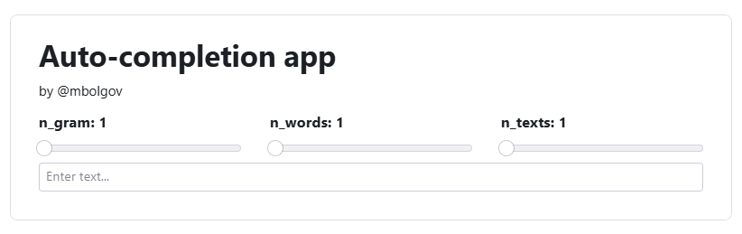
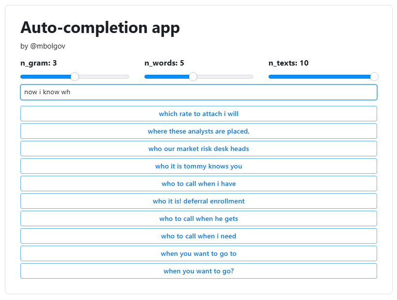

# Auto-completion App

Приложение для ускорения набора текста: пользователю предлагаются релевантные продолжения слов и фраз в реальном времени.

Проект реализован с использованием **Reflex** и собственных алгоритмов на основе **n-граммной модели** и **префиксного дерева**.

---

## Датасет

Для обучения использовался корпус email-сообщений размером более 500 000 электронных писем на английском языке:
вы можете скачать его по [ссылке](https://disk.yandex.ru/d/ikyUhWPlvfXxCg).

Так как тексты были «грязными», мы провели предобработку и удалили:
- пути и вложения
- длинные последовательности символов
- номера телефонов и IP-адреса
- спецкодировки (=09, =20 и т.п.)
- повторяющиеся знаки и слова
- CSS/HTML блоки
- ASCII-арт
- метаданные в начале писем удалены по первой пустой строке
- заголовки (`To:`, `cc:`, `Subject:` и др.)
- строки-перенаправления (`Original message`, `Forward by`)
- email-адреса и ссылки

После фильтрации мы **нормализовали** текст: привели к нижнему регистру, разделили слова пробелами. 

После этого мы провели **токенизацию**: разбили текст на слова и знаки препинания.

---

## Архитектура решения

### Префиксное дерево

Для работы с недописанными словами реализовано **префиксное дерево**:

В каждой вершине хранятся:
  - переходы по символам
  - количество слов, оканчивающихся в вершине
  - количество слов, проходящих через вершину
  - `top-k` **наиболее вероятных слов** (мы используем `k = 10`)

Благодаря этому мы смогли быстро находить кандидаты слов по заданному префиксу: спускаемся из корня дерева по префиксу и берём top-k наиболее вероятных слов, которые хранятся в найденной вершине.

---

### N-граммная модель

Для предсказания следующего слова мы использовали **n-граммную модель**.

Вероятность последовательности слов определяется как:

$$
P(w_1, \dots, w_T) = \prod_{i=1}^T P(w_i \mid w_{i-1}, \dots, w_{i-n})
$$

Оценка вероятности:

$$
P(w_i \mid w_{i-n}, \dots, w_{i-1}) \approx \frac{\text{Count}(w_{i-n}, \dots, w_{i})}{\text{Count}(w_{i-n}, \dots, w_{i-1})}
$$

Реализация:
- Для каждого `n` от `1` до `n_max` строится словарь вида `{ngram: {next_word: count, ...}, ...}`
- Затем для каждого `n` из полученного словаря для каждого `ngram` сохраняется `top-k` вариантов (мы используем `k = 10`)
- Эти `top-k` вариантов и возвращаются при запросе продолжения текста по `ngram`

Мы пробовали **параллелизацию** (с использованием `joblib`) по батчам из текстов корпусов, но они замедлили вычисления, поэтому от использования параллельных вычислений мы решили отказаться.

---

### Некоторые особенности предсказания

1. **Если пользователь ввёл только пробелы или ничего**, тогда первое слово генерируется префиксным деревом.  
2. **Иначе, если пользователь ввёл пробел**, то значит, что предыдущее слово завершено, а новое не начато, поэтому для генерации сразу же используем n-граммную модель.
   - в обоих случаях генерируем `n_words` токенов  
   - в обоих случаях исключаем знаки препинания
3. **Во всех остальных случаях пользователь пишет неполное слово**, мы дополняем его через префиксное дерево, затем все следующие `n_words` слов мы предсказываем n-граммной моделью.  

Чтобы избегать маловероятных продолжений, мы используем **beam search**:
- на каждой итерации сохраняем `top-k` наиболее вероятных вариантов
- при генерации нового токена для каждого варианта берём `top-k` наиболее вероятных продолжений
- из полученного множества (порядка $k^2$) выбираем новые `top-k` для следующего шага

---

## Интерфейс

Приложение написано с помощью **Reflex**

Приложение предоставляет:
- поле ввода текста
- кнопки для выбора автодополнения
- три ползунка для настройки параметров:
  - `n_gram` – размер n-граммы (от `1` до `5`)  
  - `n_words` – количество предсказываемых токенов (от `1` до `10`)  
  - `n_texts` – количество генерируемых вариантов текста (от `1` до `10`)  

Особенност реализации: 
- если в тексте меньше токенов, чем `n_gram`, то значение `n_gram` автоматически уменьшается
- если вариантов предсказаний нет, то меню с кнопками отображаться не будет, как на главном экране

---

## Скриншоты интерфейса

  
*Начальный экран приложения*

  
*Пример работы автодополнения*

